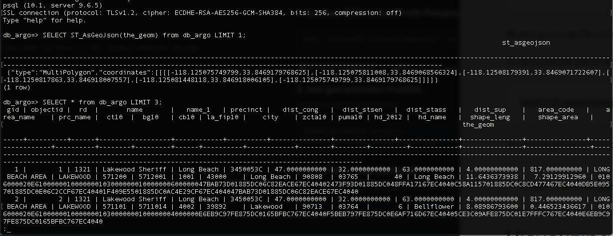

# Load GIS data into the AWS RDS
Here I will go through setting up an RDS instance with Postgres + PostGIS, and importing our geo-crosswalk data.
We used [Amazon RDS](https://aws.amazon.com/rds/), [PostgresSQL](https://www.postgresql.org/), [PostGIS](https://postgis.net/).

#### 1. Create a PostgreSQL DB Instance named `db_argo` in Amazon RDS
following [this tutorial](https://docs.aws.amazon.com/AmazonRDS/latest/UserGuide/CHAP_GettingStarted.CreatingConnecting.PostgreSQL.html#CHAP_GettingStarted.Creating.PostgreSQL).

#### 2. Connect RDS instance with Postgres
    psql --host=<DB instance endpoint> --port=<port> --username=<master user name> --password --dbname=<database name>
`DB instance endpoint` and `port` can be found on the RDS instance dashboard.

#### 3. Add geo extension PostGIS.
Type this into the psql prompt:

    CREATE EXTENSION postgis;
    CREATE EXTENSION postgis_topology;

#### Import Data using `shp2pgsql`
Have the shapefile `arcgis_intersections.shp` ready for use.

    shp2pgsql -I -W "latin1" -s 4326 -d -g the_geom arcgis_intersections.shp db_argo |psql -U <master user name> -p <port> -h <DB instance endpoint> db_argo

#### Test
Query the geometry of the first entry

    SELECT ST_AsGeoJson(the_geom) from db_argo LIMIT 1;

Query first three entries

    SELECT * from db_argo LIMIT 3;

    
