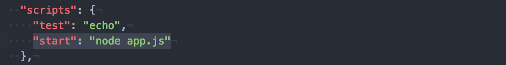

# app-express-rds-postgis

## Overview
This is a simple app that can search which geometries one certain points belongs to.

To develop this app, the following setups is needed:
- [Amazon RDS](https://aws.amazon.com/rds/)
- [PostgresSQL](https://www.postgresql.org/)
- [PostGIS](https://postgis.net/)
- [Node.js](https://nodejs.org/en/)
- [npm](https://www.npmjs.com/)
- [Express](https://expressjs.com/)
- [EJS](http://ejs.co/)
- [pg-promise](https://vitaly-t.github.io/pg-promise/index.html)
- [bluebird](http://bluebirdjs.com/docs/getting-started.html)
- [Heroku CLI](https://devcenter.heroku.com/articles/heroku-cli)
- [git](https://git-scm.com/)

## Section1. Load Location Data on AWS RDS
Here I will go through setting up an RDS instance with Postgres + PostGIS, and importing the geo-crosswalk data.
I used Amazon RDS, PostgresSQL, PostGIS in this section.

#### 1. Create a PostgreSQL DB Instance named `db_argo` in Amazon RDS
following [this tutorial](https://docs.aws.amazon.com/AmazonRDS/latest/UserGuide/CHAP_GettingStarted.CreatingConnecting.PostgreSQL.html#CHAP_GettingStarted.Creating.PostgreSQL).

#### 2. Connect RDS instance with Postgres
    psql --host=<DB instance endpoint> --port=<port> --username=<master user name> --password --dbname=<database name>
`DB instance endpoint` and `port` can be found on the RDS instance dashboard.

#### 3. Add geo extension PostGIS.
Type this into the psql prompt:

    CREATE EXTENSION postgis;
    CREATE EXTENSION postgis_topology;

#### 4. Import Data using `shp2pgsql`
Have the shapefile `arcgis_intersections.shp` ready for use. In the directory of this shapefile, type

    shp2pgsql -I -W "latin1" -s 4326 -d -g the_geom arcgis_intersections.shp db_argo |psql -U <master user name> -p <port> -h <DB instance endpoint> db_argo

#### 5. Test
Query the geometry of the first entry

    SELECT ST_AsGeoJson(the_geom) from db_argo LIMIT 1;

Query first three entries

    SELECT * from db_argo LIMIT 3;

    

Query where a certain point falls into

    SELECT *
    FROM db_argo
    WHERE ST_Contains (db_argo.the_geom, ST_GeomFromText('Point(-118.159953387143 33.8719625444075)', 4326))=TRUE;

## Section2. Develop the website on AWS Cloud9
I used Node.js, npm, Express, EJS, pg-promise, bluebird in this section. I also used AWS Cloud9 for developing, which has the developing environment ready for Node.js, so I don't need to spend time setting up local environment (debugging all kinds of unexpected conflicts). But this is not necessary. You can use whatever IDE you like.

__Notice:__ Before moving to the next step, make sure you have a `package.json` file in your folder, which is necessary when deploying on the Heroku. If not, type the following to create one

    npm init

npm is a manager of javascript libraries. Express is employed to construct the framework, and EJS makes it possible to generate HTML markup with plain JavaScript.

pg-promise and bluebird are employed for easy querying the PostgreSQL Database on AWS RDS.

__Notice__: When installing these libraries above, make sure having `--save` in the code, so that this library can be automatically recorded in the `package.json`. Like this

    npm install express --save

Before the final deployment, check the content of `package.json`. It should have all library names and versions in it. Meanwhile, make sure there is one line denoting the initial start of your project. In my case, I need to call `node app.js` to start the server. This is __important__ as it will tell the Heroku to find my starting point.

## Section3. Deploy the project on Heroku
I used Heroku CLI, git in this section.
#### 1. Heroku basic setup
Register a free account on [Heroku](https://www.heroku.com/) and download the Heroku CLI. Type

    heroku login

Check the versions of node, npm, git in your local environment, make sure they are existing and are of recent versions.

    node -v

    npm -v

    git --version

#### 2. Deploy using git
Locate to the path where you put your files developed in the Section2. Initialize a local git repo and commit your files

    git init

    git add <filename>

    git commit -m "first"

#### 3. Magic happens in Heroku
Type the following two lines

    heroku create

    git push heroku master

Now, the app is officially deployed!
