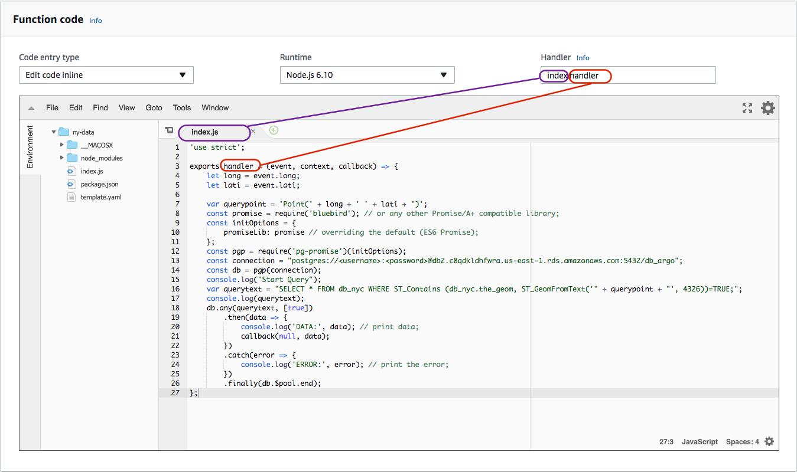

# Build an API using AWS API Gateway and Lambda
- [AWS API Gateway](https://aws.amazon.com/api-gateway/)
- [AWS Lambda](https://aws.amazon.com/lambda/)
- [AWS RDS](https://aws.amazon.com/rds/)

API Gateway takes in http calls and trigger the Lambda function. Lambda function takes in the request data (lon/lat in json format) from the API Gateway, queries the Database, and returns the result back to API Gateway. In this example, I will build an API for query geo-cross-walk data of New York City.

## Create Lambda function
1. Choose Runtime. Runtime is the runtime environment for the Lambda function you are uploading. Some major runtime supported by Lambda function are Node.js, Python, Java, Go, and C#. Here we use Node.js.
The basic syntax of Lambda function is:

        exports.myHandler = function(event, context, callback) {
            ...
            // Use callback() and return information to the caller.  
        }

2. Choose Role. Role defines the permissions this Lambda function has regarding all AWS resources.
3. Upload the .zip file containing the Lambda function you've written and its related packages.

__Note:__ The handler defines how to trigger this lambda function. "index" means to find the file "index.js", "handler" corresponds to the function name "handler".

4. Add API Gateway as trigger.

## Create API
1. In the API Gateway interface, create a new API.
2. Choose `Actions` --> `Create Resource`, here the Resource Name is "nyc".
3. Choose `Actions` --> `Create Method` as `GET`, and connect it with the Lambda function created before.

4. For this /nyc-GET Method, choose `Integration Request` --> `Body Mapping Templates`, add a mapping template in it.
- Content-Type: application/json

        {
            "long": $input.params('long'),
            "lati": $input.params('lati')
        }

5. Choose `Actions` --> `Deploy API`. Now the API is ready for query.

## Test
### Query NYC dataset:
NYU CUSP: (40.693258, -73.987493)

        https://d5tgnm602g.execute-api.us-east-1.amazonaws.com/beta/nyc?long=-73.987493&lati=40.693258

### Query LA County dataset:
Los Angeles International Airport: (33.945421, -118.408518)

        https://d5tgnm602g.execute-api.us-east-1.amazonaws.com/beta/la?long=-118.408518&lati=33.945421

You can also integrate geo-cross-walk data in your analysis using this API. See examples [here](https://github.com/argo-marketplace/LA-LocalGeo-CrossWalk/blob/master/AWS_API_Gateway/API_user_instruction.ipynb).
