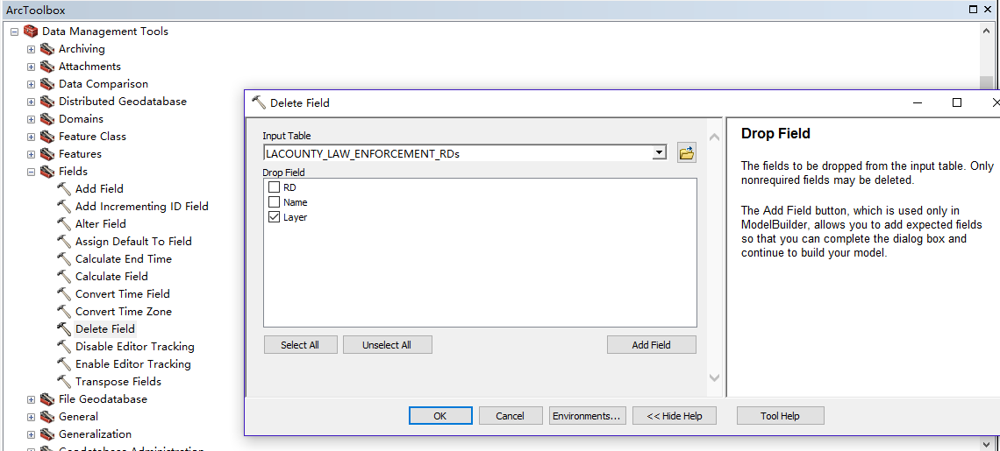
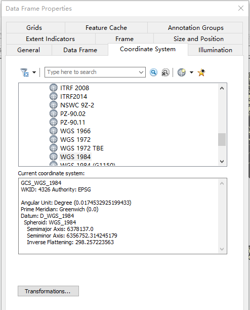
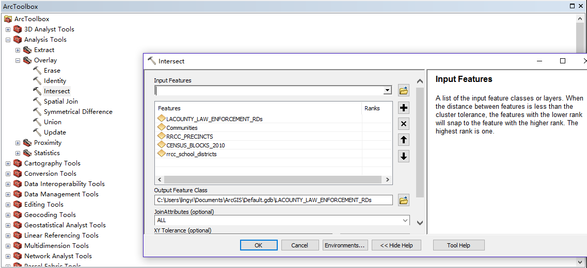

# Build the geo-crosswalk using ArcGIS.
## Data sources
- [Law Enforcement Reporting Districts](https://egis3.lacounty.gov/dataportal/2010/10/05/law-enforcement-reporting-districts/)
- [LAcounty_COMMUNITIES](https://egis3.lacounty.gov/dataportal/2010/10/21/citycommunity-boundaries/)
- [Registrar Recorder Precincts](https://egis3.lacounty.gov/dataportal/2012/12/20/2012-precincts-as-of-march-9th/)
- [Census Block (2010)](http://egis3.lacounty.gov/dataportal/2016/01/26/census_blocks/)
- [School District Boundaries (2011)](http://egis3.lacounty.gov/dataportal/2012/01/20/school-district-boundaries-2011/)

## Data Cleaning
Delete redundant columns choosing `Delete Field` in the ArcToolbox.

Before overlaying these datasets, make sure they are under the same coordinate system. (WGS 1984 in this project)

## Intersecting
Intersect all polygons using `Overlay` >> `Intersecting` in the ArcToolbox.

There are 412505 rows in the final table.
We exported it as [arcgis_intersections.csv](https://drive.google.com/file/d/1yaRMp1azgGNlv1EKMMUXXEALfReRfz_7/view?usp=sharing) and also the shapefile format [arcgis_intersections.zip](https://drive.google.com/file/d/1c3Ja2jkVFN8kRq5ANPyTovyZZlwEBrd5/view?usp=sharing)

## Metadata of the final `arcgis_intersections.csv`
| Column Name | Meaning |
| ------------- | ------------- |
| RD | Law Enforcement Reporting Districts Numbers |
| Name | Law Enforcement Reporting Districts Names |
| NAME_1 | La County Communities |
| PRECINCT | Registrar Recorder Precincts Number |
| DIST_CONG | Congressional Districts |
| DIST_STSEN | State Senate Districts |
| DIST_STASS | State Assembly Districts |
| DIST_SUP | 2011 Supervisorial Districts |
| AREA_CODE | Area Number |
| AREA_NAME | Area Name |
| PRC_NAME | Registrar Recorder Precincts Names |
| CT10 | 2010 Census Tracts |
| BG10 | 2010 Block Groups |
| CB10 | 2010 Census Blocks |
| LA_FIP10 | Federal Information Processing Standard |
| CITY | City Name |
| ZCTA10 | Postal Code |
| PUMA10 | Public Use Microdata Areas |
| HD_2012 | Health Districts Numbers |
| HD_NAME | Health Districts Names |
